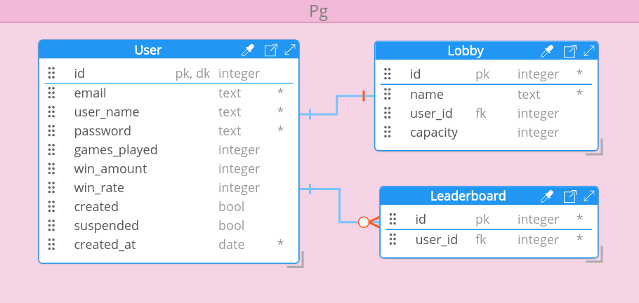

# Spellcaster
Spellcaster is a revolutionary online spelling application that combines the act of learning English with the excitement and engagement of playing a game. This innovative approach to language learning allows users to improve their spelling skills while enjoying themselves, making the process of learning more enjoyable and effective.

Whether you are a student looking to improve your English proficiency or a language enthusiast looking to enhance your spelling abilities, Spellcaster is the perfect tool for you. With its intuitive design and engaging gameplay, Spellcaster makes it easy and fun to learn English.

Additionally, Spellcaster offers the ability to play with friends or classmates, allowing for a more social and collaborative learning experience. However, if you don't have anyone to play with, don't worry – Spellcaster also offers online lobbies where you can connect with other users and play together.

Overall, Spellcaster is a highly effective and enjoyable way to learn English. With its unique blend of learning and gaming, Spellcaster makes it easier and more enjoyable to improve your spelling skills and expand your English vocabulary.

The project is developed within a <a href="https://www.delta-skola.cz/talentovy-program-delta-topgun">school program at DELTA - Střední škola informatiky a ekonomie, s.r.o.</a> This program is designed to foster and support the growth of young talent in the fields of computer science and economics.

As a participant in this program, the project has access to state-of-the-art resources and expertise, allowing for the development of cutting-edge technologies and solutions. The program also provides a unique learning environment that encourages collaboration, creativity, and innovation.

## User stories

* as a **guest** I want to be able to create a new account
* as a **guest** I want to be able to log into my existing account
* as a **guest** I want my login information to be saved, so I don't have to fill in my login information again
* as a **user** I want to be able to log out
* as a **user** I want to be able to see my stats, so I can compare myself to my friends
* as a **user** I want to be able to see the **global leaderboard**, so I can compare myself to all other players
* as a **user** I want to be able to join an existing lobby, so I can join my friend's lobby
* as a **user** I want to be able to create a new game lobby and invite other players to join
* as a **player** I want to be able to see if the game has already started
* as a **Word Master** I want to be able to input a word that other players can spell
* as a **Word Speller** I want to hear the typed word from the **Word Master**, so I can type it
* as a **player** I want to be able to be placed on the game's **lobby leaderboard** so I can compare myself to other players in the lobby
* as a **player** I want to be able to win the game, so I can rank better in the **global leaderboard**

## Acceptance criteria

The web application enables the simultaneous connection of multiple users across multiple lobbies. This allows for a highly interactive and engaging experience, as users can join different lobbies and connect with other players from around the world.
### Authentication

#### Register
The registration page should consist of a submit button and three input fields for the user's username, email address, and password. If any of the inputs does not meet the requirements specified in the Acceptance Criteria->Account section, a warning text should appear informing the user of the error. This ensures that users are able to register for the application with accurate and complete information, facilitating a smooth and efficient registration process.

#### Login
The login page will consist of a submit button, input fields for the user's email address and password, and a checkmark for saving the user login. This means that when users visit Spellcaster again, they will be automatically authenticated if they did not log out, eliminating the need to re-enter their login information. This feature enhances the user experience by providing a convenient and efficient way to access the application.

### guest

In order to participate, users must create an account. Each account consists of a unique username, email address, and password. This ensures that users have secure and personalized access to the application and its features. The requirement for an account ensures that users are able to access the application with a consistent and verifiable identity, facilitating a secure and engaging experience.

#### Account

* The username is allowed to consist of lowercase letters, numbers, dots, and underscores. However, the length of the username cannot exceed 16 characters. These rules ensure that users are able to create unique and recognizable username, while also limiting the length of the username to prevent potential issues. The restrictions on the username help to maintain the integrity and security of the application, while also providing a consistent and user-friendly experience.
* Every account has to have a valid email address linked to it. Overall, the requirement for a valid email address linked to each account helps to ensure the security and integrity of the application.
* The password must contain at least 8 characters, including at least one letter and one number. This requirement ensures that users create strong and secure passwords for their accounts.

After registering, guests will receive an email containing a link to an "agree to TOS" screen. Until the user agrees to the TOS, the account will be considered to be a guest account and will be marked as not-created. This allows users to review the TOS and make an informed decision about whether they want to create an account and use the application. The requirement to agree to the TOS helps to ensure that users are aware of and agree to the terms and conditions governing their use of the application.
### user

After creating an account and agreeing to TOS, we consider the guest to be a user. They now have access to the application.
They can create a **new lobby**, join an **existing lobby**, view their **profile**, view the **global leaderboard**.

#### profile
Each user will be able to view their profile, which will display their general information such as their win rate, games played, name, and bio. This allows users to see their personal statistics and profile information, providing a convenient way to track their progress and learn more about themselves and other users. The ability to view one's own profile enhances the user experience by providing users with a comprehensive view of their activity and information within the application.

#### global leaderboard
All users are displayed on a global leaderboard ranked by their win rate

#### existing lobby
To join a lobby, you will need to have an invitation link. This invitation link will simply be an url to the lobby.

#### new lobby
As a user, you can create a new lobby and invite your friends to play with you. To do this, simply create the lobby and an invitation link will be generated for you to share with your friends. The invitation link will simply be the url to the lobby.

### player
After joining an existing lobby or creating a new one, you will acquire the status of a player. While playing the game, you can become one of two roles: either a **Word Master** or a **Word Speller**.

### Word Master
During each iteration of the game, one of the players will become the Word Master. In this role, the player must input a valid English word into the prompt that appears on the screen. This word will then be played out loud for the Word Speller role to hear and spell. After inputting the word, the Word Master will gain 1 point.

### Word Speller
As a Word Speller, your role is spelling the word given by the Word Master. The word will be played out loud, and you can choose to play it again if needed. Once you have spelled the word correctly, you will gain 1 point.

## Technical Overview
### Frontend
TODO text to speech, websockets

The application's frontend is written in the React ecosystem. Using React as the frontend library of choice. React router as the 
router. For styling the application uses styled-components with the additional vanilla CSS when convenient.

### Backend
The API is written using the Go programming language. For the database the application uses Postgresql.

#### Endpoints

**POST** *Registers a new user*

Successful request will result in: 201 Created

Unsuccessful request will result in: 
* 400 Bad Request - user already has an account created.
```
{{baseUri}}/api/user/register?{"userName":string,"email":string,"password":string}
```

**GET** *Login an existing user*

Successful request will result in: 200 OK

Unsuccessful request will result in:
* 400 Bad Request - user doesn't exist.
```
{{baseUri}}/api/user/login?{"email":string,"password":string}
```

**GET** *Shows user information*

Successful request will result in: 200 OK

Unsuccessful request will result in:
* 400 Bad Request - user doesn't exist.
```
{{baseUri}}/api/user/profile?{"email":string}
```

**GET** *Shows global leaderboard*

Successful request will result in: 200 OK

Unsuccessful request will result in:
* 500 Internal Server Error - server encountered an unexpected condition
```
{{baseUri}}/api/leaderboard}
```

**GET** *Shows not started active lobbies*

Successful request will result in: 200 OK

Unsuccessful request will result in:
* 500 Internal Server Error - server encountered an unexpected condition
```
{{baseUri}}/api/lobby}
```

**POST** *Create a new lobby*

Successful request will result in: 200 OK

Unsuccessful request will result in:
* 400 Bad Request - client error
* 403 Forbidden - an active lobby with the same name already exists
```
{{baseUri}}/api/lobby/new?{"name":string}}
```

**POST** *Join a lobby*

Successful request will result in: 200 OK

Unsuccessful request will result in:
* 403 Forbidden - lobby is full
```
{{baseUri}}/api/lobby?{"name":string}}
```

**POST** *Start the game*

Successful request will result in: 200 OK

Unsuccessful request will result in:
* 403 Forbidden - lobby could not be started (usually because the player count did not exceed 1)
```
{{baseUri}}/api/lobby/start?{"name":string,"email":string}}
```

**GET** *List players in lobby*

Successful request will result in: 200 OK

Unsuccessful request will result in:
* 400 Bad Request - lobby does not exist
```
{{baseUri}}/api/lobby/players?{"name":string}}
```

**POST** *Inputs word to be spelled by Word Master*

Successful request will result in: 200 OK

Unsuccessful request will result in:
* 400 Bad Request - the word did not match accepted pattern
* 403 - user roles did not match
```
{{baseUri}}/api/lobby/Spellcaster?{"word":string}}
```

**POST** *Inputs spelled word by Word Speller*

Successful request will result in: 200 OK

Unsuccessful request will result in:
* 400 Bad Request - the string did not match accepted pattern
* 403 - user roles did not match
```
{{baseUri}}/api/lobby/spelled?{"word":string}}
```

**GET** *Lobby score*

Successful request will result in: 200 OK

Unsuccessful request will result in:
* 400 Bad Request - lobby does not exist
```
{{baseUri}}/api/lobby/stats?"name":string}
```

**POST** *Increase score*

Successful request will result in: 200 OK$

Unsuccessful request will result in:
* 400 Bad Request - user does not exist
```
{{baseUri}}/api/lobby/increase?"email":string,"value":number}
```

## Component Diagram


## Database model



## Frontend

This project was bootstrapped with [Create React App](https://github.com/facebook/create-react-app).

### Available Scripts

In the project directory, you can run:

#### `npm start`

Runs the app in the development mode.\
Open [http://localhost:3000](http://localhost:3000) to view it in your browser.

The page will reload when you make changes.\
You may also see any lint errors in the console.

#### `npm test`

Launches the test runner in the interactive watch mode.\
See the section about [running tests](https://facebook.github.io/create-react-app/docs/running-tests) for more information.

#### `npm run build`

Builds the app for production to the `build` folder.\
It correctly bundles React in production mode and optimizes the build for the best performance.

The build is minified and the filenames include the hashes.\
Your app is ready to be deployed!

See the section about [deployment](https://facebook.github.io/create-react-app/docs/deployment) for more information.

#### `npm run eject`

**Note: this is a one-way operation. Once you `eject`, you can't go back!**

If you aren't satisfied with the build tool and configuration choices, you can `eject` at any time. This command will remove the single build dependency from your project.

Instead, it will copy all the configuration files and the transitive dependencies (webpack, Babel, ESLint, etc) right into your project so you have full control over them. All of the commands except `eject` will still work, but they will point to the copied scripts so you can tweak them. At this point you're on your own.

You don't have to ever use `eject`. The curated feature set is suitable for small and middle deployments, and you shouldn't feel obligated to use this feature. However we understand that this tool wouldn't be useful if you couldn't customize it when you are ready for it.

### Learn More

You can learn more in the [Create React App documentation](https://facebook.github.io/create-react-app/docs/getting-started).

To learn React, check out the [React documentation](https://reactjs.org/).

#### Code Splitting

This section has moved here: [https://facebook.github.io/create-react-app/docs/code-splitting](https://facebook.github.io/create-react-app/docs/code-splitting)

#### Analyzing the Bundle Size

This section has moved here: [https://facebook.github.io/create-react-app/docs/analyzing-the-bundle-size](https://facebook.github.io/create-react-app/docs/analyzing-the-bundle-size)

#### Making a Progressive Web App

This section has moved here: [https://facebook.github.io/create-react-app/docs/making-a-progressive-web-app](https://facebook.github.io/create-react-app/docs/making-a-progressive-web-app)

#### Advanced Configuration

This section has moved here: [https://facebook.github.io/create-react-app/docs/advanced-configuration](https://facebook.github.io/create-react-app/docs/advanced-configuration)

#### Deployment

This section has moved here: [https://facebook.github.io/create-react-app/docs/deployment](https://facebook.github.io/create-react-app/docs/deployment)

#### `npm run build` fails to minify

This section has moved here: [https://facebook.github.io/create-react-app/docs/troubleshooting#npm-run-build-fails-to-minify](https://facebook.github.io/create-react-app/docs/troubleshooting#npm-run-build-fails-to-minify)
